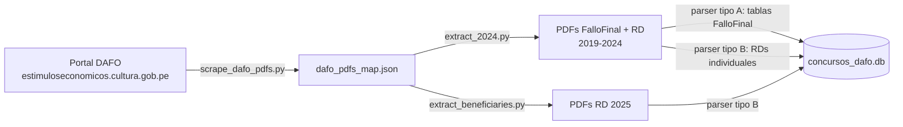

# Pipeline de extracción

## Estrategias de parsing

### Tipo A — FalloFinal
PDFs con tabla multi-beneficiario. Se extrae fila por fila: empresa, responsable, monto, región.

### Tipo B — Resolución Directoraldividual (RD)
Un beneficiario por PDF. Se extrae del artículo primero.

## Problemas conocidos

- [[DAFO_Auditoria_2026-06-13#Falta masiva de DNI/RUC|DNI/RUC no se extraen]] — el parser no captura el número de documento
- [[DAFO_Auditoria_2026-06-13#Montos anómalos|Montos < S/100]] — columnas mal alineadas en tablas antiguas
- [[DAFO_Auditoria_2026-06-13#Resolución duplicada|Resolución duplicada]] — un fallo final insertado 2 veces
- ~177 PDFs con formato no estándar no procesados

Ver [[flujo_extraccion]] para diagrama detallado.
