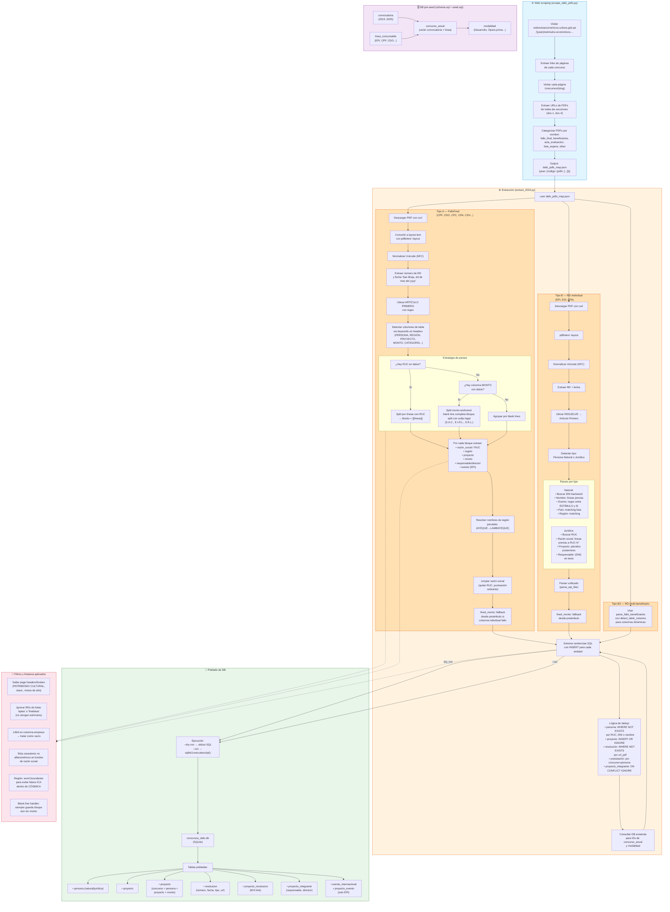

# Diagrama de Flujo — Extracción DAFO

## Resumen del recorrido

| Fase | Script | Entrada | Salida |
|------|--------|---------|--------|
| **Scraping** | `scrape_dafo_pdfs.py` | `estimuloseconomicos.cultura.gob.pe` | `dafo_pdfs_map.json` (URLs de PDFs por año/código) |
| **Extracción** | `extract_2024.py` | `dafo_pdfs_map.json` + `concursos_dafo.db` (lookups) | Sentencias SQL INSERT |
| **Poblado** | `extract_2024.py --run` | SQL generado en memoria | `concursos_dafo.db` (SQLite) |
| **Seed** | `schema.sql` + `seed.sql` | SQL | `concursos_dafo.db` (estructura + datos semilla) |

### Tipos de parseo por concurso

- **FalloFinal (tabla multi-beneficiario):** CPF, CDO, CPC, CPA, CDV, CGC, CFO, CCC, CCM, CDC, CGS, CIN, CCE, CIC
- **RD individual (single-entry):** EPI (natural), EDI (jurídica), EPA (jurídica)
- **RD multi-beneficiario:** Todos los demás códigos detectados como `other` que contienen `-RD` en el filename
