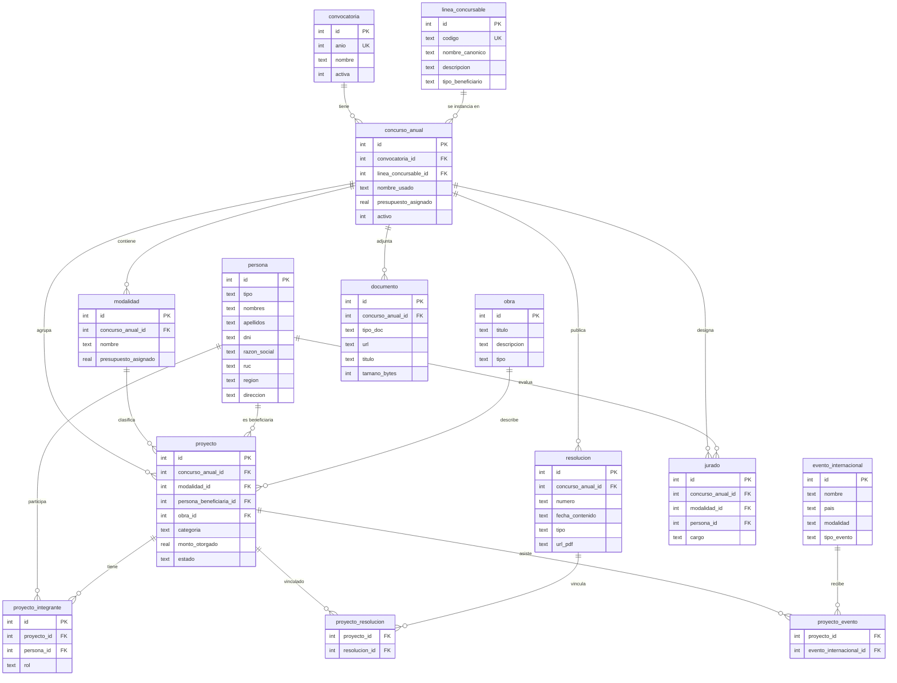

# Diagrama ER - Base de Datos DAFO



## Estructura simplificada

```
convocatoria (año)
  └─ concurso_anual (EPI 2025, CPF 2025...)
       ├─ modalidad (Desarrollo, Producción...)
       └─ proyecto (postulación beneficiada)
            ├─ obra (título, descripción)
            ├─ persona (beneficiario: natural o jurídica)
            ├─ proyecto_integrante (responsable, director)
            ├─ proyecto_resolucion (fallo, RD)
            └─ proyecto_evento (festivales EPI)
```

## Tablas principales (12)

| Tabla | Propósito |
|-------|-----------|
| `convocatoria` | Edición anual del programa |
| `linea_concursable` | Línea de concurso (EPI, CPF, CDV...) |
| `concurso_anual` | Instancia de una línea en un año |
| `modalidad` | Subcategoría del concurso |
| `persona` | Persona natural o jurídica (unificada) |
| `obra` | Metadatos del proyecto postulado |
| `proyecto` | Postulación beneficiada |
| `proyecto_integrante` | Roles dentro del proyecto |
| `resolucion` | Documento legal de resultados |
| `proyecto_resolucion` | Proyecto ↔ Resolución (M:N) |
| `evento_internacional` | Festival/mercado (solo EPI) |
| `proyecto_evento` | Proyecto ↔ Evento (M:N) |
| `jurado` | Evaluadores del concurso |
| `documento` | PDFs publicados (bases, anexos) |
